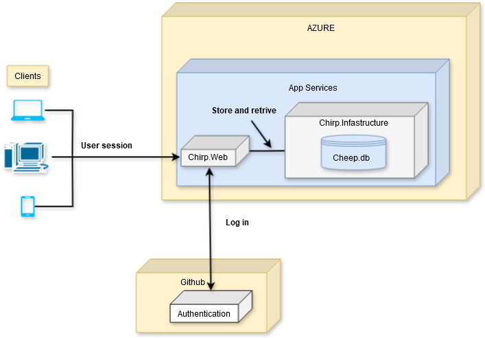
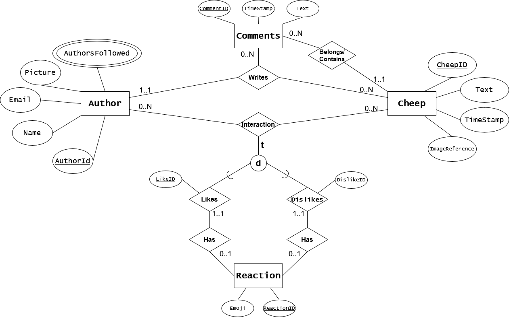

---
header-includes:
  - \usepackage{listings}
  - \lstset{breaklines=true, breakatwhitespace=true}
---

# Chirp\! Project Report


## ITU BDSA 2024 - Group 7
Analysis, Design and Software Architecture - BSANDSA1KU

Marcus Løfberg [loef@itu.dk](mailto:loef@itu.dk)  
Nikolaj Ho Alsøe [nals@itu.dk](mailto:nals@itu.dk)  
Nikolaj Heuer Løjmand Carlson [nhca@itu.dk](mailto:nhca@itu.dk)  
Rasmus Alexander Christiansen [ralc@itu.dk](mailto:ralc@itu.dk)  
Mathias Niklas Larsen [mnla@itu.dk](mailto:mnla@itu.dk)

# Design and Architecture of Chirp

## Domain Model


## Architecture — In the small 

 
The Onion Architecture has been implemented in the project. Each layer of the diagram represents a separate isolated .NET project. A layer may only interact with adjacent layers. 

## Architecture of deployed application

The application was hosted using Microsoft’s Azure App Service. Via this service, a given client can connect to our Chirp.Web application that contains our Razor Pages.  
Chirp.Infrastructure facilitates functionality between client interactions, our database model, and our repositories.  

  
A user will connect to the Chirp.Web application to interact with its features. Chirp.Web will then call Chirp.Infrastructure to store the data. If the user chooses to log in via GitHub, Chirp.Web will call GitHub's authentication service using OAuth \- otherwise Chirp.Infrastructure handles the login request. The internal sign-in manager in Chirp.Web is used to create a user or retrieve credentials from a user in the database. The user credentials from GitHub or local user creation are stored in the database.

### Database ER-Diagram


(A Reaction requires the Author to have either a like or a dislike on the same Cheep)

When implementing the first feature where Authors could follow each other, a decision was made, such that the Author entity created a list of strings to store the usernames of followed authors called AuthorsFollowed. However, this creates a multi-valued attribute in the Author entity which will decrease performance if an Author follows a lot of other Authors. The process for displaying a user's timeline can therefore be costly as it consists of querying the user’s followed authors in the database based on the username, and then retrieving the subsequent cheeps to display in the user timeline.  
As an alternative, a list of Authors instead of a string could have been created, which would have allowed EF Core to generate a navigation property, so we would no longer have to query to find the author.

The application currently gathers the list of authors that follow a user by iterating through the list of author usernames O(n), and then checking if the specified user is in their AuthorsFollowed list. An improvement to the Author entity could be made by giving it a FollowedBy attribute which authors could be appended to. The process would then be simplified as it would no longer have to search through our entire authors table which would become costly if we had a lot of users.

## User activities


## Sequence of functionality/calls through Chirp\! 

  
This sequence illustrates the calls made when fetching data from the application. This diagram illustrates how an unauthorized user can access the homepage.

# Process

## Build, test, release, and deployment

### Build and Test Workflow

The workflow begins when a branch has been merged into the main branch. The workflow starts by attempting to restore dependencies and then build the project. If the workflow´s build is successful, it will run the unit-, integration- and end-to-end tests.  The workflow also makes sure to run the application in the background, otherwise Playwright won’t work (as it tests UI). The workflow also has to install PlayWright Dependencies for it to work. Once all that is done, the E2E tests will run.

### Deploying To Azure Workflow

Once a pull request's branc has been merged into the main branch, the workflow for deploying to Azure will start. It starts by installing .NET 8, followed by building the application. It then uses ‘dotnet publish’ to create a self-contained deployment-ready package, and uploads the necessary artifacts.  The workflow will then begin to prepare for deployment. It downloads the previously uploaded artifacts and proceeds to log in to Azure using credentials given by the repository secrets. It will then deploy the artifacts to Azure, and the web app will now be available on Azure’s website. 

### Release Workflow

The release workflow starts when a commit has the tag ‘v’ in its name. After the workflow will retrieve the newest code from the repository and install .NET 8\. The workflow restores the application’s projects to make sure all dependencies have been installed, and afterward, it will build the application. It will run all the tests, to make sure everything works as intended. Afterward, it will create the release name and run ‘dotnet publish’ to create a deployment-ready package. In the end, it creates the different ZIP releases for the different platforms, and creates the GitHub release with all the files.

### Issue Adder Workflow

When an issue has been opened, the issue adder workflow begins. This executes the action, ‘add-to-project’ that adds the issue itself to the project board. The purpose is to streamline creating issues.


## Teamwork


### Flow from creating issue to final implementation of a feature:

- Once a feature has been decided,  an issue will be created. The author of the issue then adheres to:   
  - Describe the reasoning for creating the feature.   
  - Describe what the feature should do.  
  - Give some acceptance criteria. Should the feature be created in a certain way, or output a certain thing once done, etc.   
- Once the issue has been created it is automatically added to the project board. Here the issue can be placed into different categories: “Not Prioritized atm.”, “Todo”, “In Progress”, “Features for next Release” or “Done”. If the issue is mandatory/deemed necessary, it will be put into “Todo”. Otherwise, it will be put into “Not Prioritized atm”.  
- Once a feature is being worked on, it will be put in “In Progress”. Then a new branch will be created for the feature work.   
- Once the work on the feature is done, and the work has been merged in through a pull request, the issue for the feature will be put into “Features For Next Release”. This category is used to know which features, bug fixes, or tests that have been added since the last release.  
- Once a release has been created, the issues placed in “Features For Next Release” will be put into “Done” to signal their completion. 

### Tasks missing/incomplete:

- The helper methods created for the E2E tests are not optimal. The idea behind the helper methods was to reduce redundant code. Since in a lot of the tests it was required to create a user and then also log in with the user. Instead of including this code explicitly in each test that required it, helper methods were created to centralize the functionality. The problem is that the helper methods use the code generated by Playwright and not API calls to the functions specifically in the program. API calls are a better choice because, if the UI changes in the future, the helper methods would not need to be refactored, unlike the current implementation.

## How to make Chirp\! work locally

1. Clone the repository using  
   `git clone https://github.com/ITU-BDSA2024-GROUP7/Chirp.git`

2. .NET8 is needed to run this application which can be downloaded here: [https://dotnet.microsoft.com/en-us/download/dotnet/8.0](https://dotnet.microsoft.com/en-us/download/dotnet/8.0)   
     
3. Before running the app GitHub secrets have to be set up. This is for OAuth to work so that a user can register and login through GitHub (though it is also required for the normal program to work)  

    1. To set up GitHub secrets, first move into the Chirp.Web project `cd src\\Chirp.Web`
    
    2. Afterwards create the metadata file necessary by writing:   
   ``dotnet user-secrets init``
     
   3. Then write and execute each following command separately:  
      1. `dotnet user-secrets set "authentication/_github/_clientId" "Ov23liFuhCLOJY4s2nRA"`

      2. `dotnet user-secrets set "authentication/_github/_clientSecret" "32064af9ea476229907a38ef4bd92a15bc1e2778"`  

4. Navigate to the directory of the repo called Chirp.Web and run the command `Dotnet watch` to start the application

## How to run the test suite locally

### Description of test suite

In the project, there are 3 types of tests: Unit tests, Integration tests, and E2E tests.

Unit tests (Chirp.TestUnit) focus only on one specific function and ensure that the process works in an isolated environment. 

Integration tests (Chirp.TestIntegration) focus on specific endpoints, to make sure that the application gets the correct output. These focus on either the author's following list or the cheeps on the web app.

E2E tests (Chirp.TestE2E) focus mainly on UI aspects of the web app. This can be anything from testing if the follow button works as intended, or if the user can write a cheep with an image attached. These focus on everything that the general user can do with the application. 

#### How to run Playwright tests for the project:

If PowerShell is not installed

1. Run this command in CMD:
```bash
winget search Microsoft.PowerShell
```  
2. Then execute the following command using bash  
```bash
winget install --id Microsoft.PowerShell --source winget 
```  
    
     
3. Afterward, locate PowerShell 7 (the pwsh.exe file) and set it as a PATH environment variable:

(Typically located here: C:\\Program Files\\PowerShell\\7\\pwsh.exe)

If/when Powershell has been installed:

1. Navigate to the Chirp.TestE2E project:

```bash
cd test\Chirp.TestE2E
```
2. Afterwards, run `dotnet build` so that the Playwright installation file has been created  
     
3. Then execute the following command to install Playwright:
```bash
pwsh bin\Debug\net8.0\playwright.ps1 install
```  
   


### Running the tests

To be able to run the test you should enter their respective directories:


```bash
cd test/Chirp.TestE2E 
```
```bash
cd test/Chirp.TestIntegration 
```
```bash
cd test/Chirp.TestUnit
```

Now use `dotnet test` to run the tests. 

It’s important to note that the E2E tests are ‘flaky’ when running all at the same time. This means that when running all the tests sequentially, some of the tests might fail, but all tests can pass successfully when being run isolated. This is something that we looked into, but haven’t been able to find a fix for.

Furthermore, an issue might arise where the end-to-end test cannot start the web application in the background because the port is occupied. This has been studied a lot, and the conclusion is that the test doesn’t always close correctly which results in the web application in the background doesn’t stop.

To avoid this behavior we strongly suggest that you run an instance of the program in the background using `dotnet watch` in Chirp.Web before running the `dotnet test` command in Chirp.TestE2E.

# Ethics

## License

* We’ve chosen an: MIT License

## LLMs, ChatGPT, CoPilot, and others (Mathias)

**ChatGPT, CoPilot, and Claude**

ChatGPT, CoPilot, and Claude were used for.

- Troubleshooting and debugging  
- Code generation and auto-completions.

When writing code, we often found ourselves more confused by the use of LLMs, given its sometimes narrow context window, although it was useful in breaking down tasks for a feature.   
The autocomplete feature did increase coding productivity, but it often required correction as it didn’t always follow the same direction as intended. For instance, when adding a link in the service layer to the repository, it would often autocomplete with the wrong method. In many cases, we found better answers by searching our issues on Google, which often redirected us to StackOverflow. The most helpful LLM was Copilot, as it could analyze the current files and gain context for more parts of the workspace.

This was where the LLMs excelled, as Copilot could acquire context, simplify trivial debugging scenarios, and assist in solving significant bugs, although we also referred to documentation, StackOverflow, and occasionally YouTube videos for clarity, as LLMs sometimes hallucinate.  
ChatGPT was also beneficial in identifying the correct placement for dealing with compiler warnings in the code.

**CodeFactor**

During the initial weeks of the project and much of the development, we used CodeFactor for our pull requests. It often suggested minor formatting improvements, such as removing unnecessary spaces. Ultimately, we stopped using it because it started suggesting the removal of curly brackets and methods from the code, as it did not align with our preferences, we decided to discontinue its use.